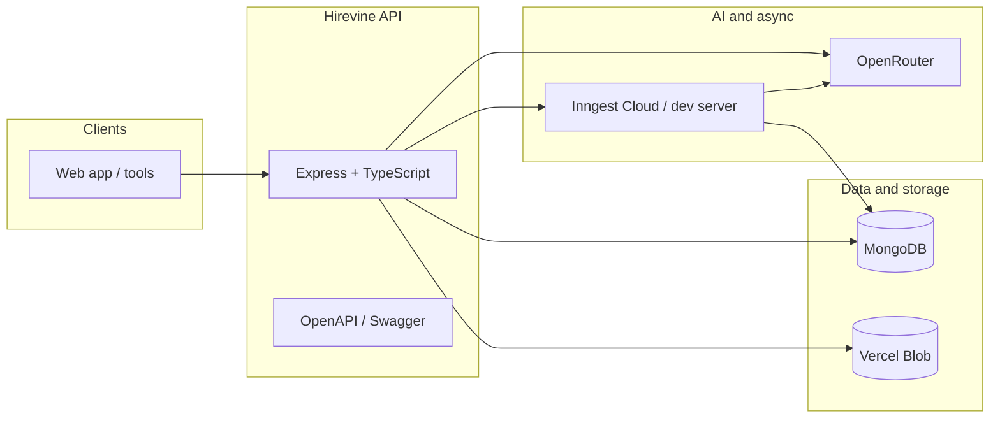

# Hirevine API

Backend service for **Hirevine**, a hiring automation platform that helps teams publish roles, collect applications with resumes, run structured evaluation pipelines (resume screening, role-specific quiz, and hiring-manager summaries), and review outcomes in one place.

This repository is the **HTTP API** layer: authentication, organizations and jobs, resume storage, application lifecycle, OpenAPI documentation, and asynchronous pipeline execution via [Inngest](https://www.inngest.com/).

---

## Table of contents

- [Product overview](#product-overview)
- [What the API provides](#what-the-api-provides)
- [Architecture](#architecture)
- [Requirements](#requirements)
- [Local development](#local-development)
- [Configuration](#configuration)
- [API documentation](#api-documentation)
- [Background jobs (Inngest)](#background-jobs-inngest)
- [Repository layout](#repository-layout)
- [Scripts](#scripts)
- [Deployment](#deployment)
- [Operations and security notes](#operations-and-security-notes)

---

## Product overview

**For recruiting teams**, Hirevine supports:

- **Organizations** — A recruiter (or admin) works within an employer organization and manages jobs under that org.
- **Job postings** — Create and maintain jobs; optionally generate an **AI-defined hiring pipeline** for a job (structured stages, quiz content, and screening logic) when OpenRouter is configured.
- **Application visibility** — List and inspect applications org-wide or per job, including pipeline status, per-node scores and reasoning, and final summaries.

**For candidates**, Hirevine supports:

- **Discovery** — Browse active jobs across organizations.
- **Apply** — Upload a resume (stored on **Vercel Blob**), then apply to a job using the returned resume URL.
- **Assessment** — Complete a pipeline **quiz** when the application reaches the quiz stage; outcomes feed the final reporting step.

**Roles** (see `User` model): `recruiter`, `candidate`, and `admin`. Candidates may apply across orgs; authorization for sensitive actions is enforced per route (org-scoped recruiter operations vs candidate self-service).

---

## What the API provides

| Area | Highlights |
|------|------------|
| **Auth** | Email/password; JWT in an HTTP-only cookie and the same token as `accessToken` in JSON for Bearer use. |
| **Organizations** | Employer org lifecycle for recruiters/admins. |
| **Jobs** | CRUD-style job management, public listing of active jobs, **generate-pipeline** (AI) for configured pipelines. |
| **Resumes** | Multipart upload to Blob; validated URLs on apply. |
| **Applications** | Apply, candidate “my applications,” quiz fetch/submit, recruiter/admin listing with filters and pagination. |
| **System** | Health check, API metadata, OpenAPI + Swagger UI. |

Success and error shapes are consistent: success `{ "success": true, "data": ... }`, errors `{ "success": false, "error": { "code", "message" } }` (see OpenAPI description in `src/docs/openapi.ts`).

---

## Architecture



**Stack** (from `package.json`):

- **Runtime:** Node.js 20+
- **Framework:** Express 4
- **Language:** TypeScript (strict), compiled to `dist/`
- **Database:** MongoDB via Mongoose
- **Validation:** Zod (where used in routes/services)
- **AI:** Vercel AI SDK + OpenRouter for pipeline generation, resume screening, and final report synthesis
- **Files:** Multer + `@vercel/blob` for resume uploads
- **Async workflows:** Inngest
- **Docs:** `swagger-ui-express` + hand-maintained OpenAPI spec

---

## Requirements

- **Node.js** ≥ 20
- **MongoDB** (local, Atlas, or compatible)
- **Optional but recommended for full behavior:**
  - **Vercel Blob** token for resume uploads in production-like environments
  - **OpenRouter** API key for real AI (pipeline generation, Inngest Node 1 and Node 3); without it, relevant endpoints may return **503** or use **stubs** for async steps
  - **Inngest** signing and event keys in production so `/api/inngest` and `inngest.send` work end-to-end

---

## Local development

1. **Clone and install**

   ```bash
   git clone <repository-url>
   cd hirevine-v2-be
   npm ci
   ```

2. **Environment**

   Copy `.env.example` to `.env` and adjust values. For a minimal local run, MongoDB is the main variable you may need to change; see [Configuration](#configuration).

3. **Run the API**

   ```bash
   npm run dev
   ```

   Default port is **8000** unless `PORT` is set (`src/config/env.ts`).

4. **Run Inngest locally (recommended)**

   In a second terminal, with the API already listening:

   ```bash
   npm run inngest:dev
   ```

   This points the Inngest dev server at `http://127.0.0.1:8000/api/inngest`. Without Inngest, apply/quiz flows will not progress through automated nodes.

5. **Typecheck / production-style run**

   ```bash
   npm run typecheck
   npm run build
   npm start
   ```

---

## Configuration

Environment variables are documented inline in **`.env.example`** (comments, defaults, and safety notes). `src/config/env.ts` is the source of truth for parsing and defaults.

**Commonly set in production:**

| Variable | Purpose |
|----------|---------|
| `NODE_ENV` | `production` for secure cookie defaults and required `JWT_SECRET` |
| `MONGODB_URI` | Database connection string |
| `JWT_SECRET` | Signs session JWTs (required in production) |
| `CORS_ORIGIN` | Comma-separated allowed origins for credentialed browser calls |
| `BLOB_READ_WRITE_TOKEN` | Resume uploads to Vercel Blob |
| `OPENROUTER_API_KEY` | AI features (pipeline generation + Inngest nodes) |
| `INNGEST_SIGNING_KEY` / `INNGEST_EVENT_KEY` | Inngest Cloud ↔ API |

Optional tuning includes `JWT_EXPIRES_SEC`, `OPENROUTER_MODEL`, `AUTH_COOKIE_*`, `RESUME_UPLOAD_MAX_BYTES`, and OpenRouter attribution headers. **Do not** set `ALLOW_ANY_RESUME_URL` in production.

---

## API documentation

- **Swagger UI:** `GET /api-docs` (after starting the server)
- **OpenAPI JSON:** `GET /openapi.json`
- **Health:** `GET /health`
- **Entry links:** `GET /`

**Tip:** For Swagger “Try it out,” stay on a single host (`localhost` *or* `127.0.0.1`). Use credentialed requests first; if `/api/auth/me` returns 401, authorize with **Bearer** using `accessToken` from login. On plain HTTP in production-like local runs, you may need `AUTH_COOKIE_SECURE=false` so the browser accepts the session cookie (see `.env.example`).

---

## Background jobs (Inngest)

Long-running or multi-step evaluation runs **outside** the request that creates or updates an application:

1. **Application created** — **Node 1** fetches resume text, runs **resume screening** (AI when `OPENROUTER_API_KEY` is set; otherwise a stub pass). May set status to `REJECTED` based on the job pipeline’s pass threshold.
2. **Quiz stage** — When the run reaches **`NODE_2_PENDING`**, the candidate can load and submit the quiz via the applications API.
3. **Quiz submitted** — **Node 3** produces a **hiring-manager-style summary** (AI when configured; otherwise a short stub).

Handlers live under `src/inngest/functions/`. Production registration requires the Inngest app **Serve URL** to point at `https://<your-api-host>/api/inngest` (see [DEPLOY.md](./DEPLOY.md)).

---

## Repository layout

| Path | Role |
|------|------|
| `src/server.ts` | Process entry (local / long-running hosts) |
| `src/httpApp.ts` | Express app factory (routes, middleware; not named `app.ts` — Vercel reserves `src/app` for native Express) |
| `src/config/env.ts` | Environment loading and validation |
| `src/routes/` | HTTP route modules (`auth`, `organizations`, `jobs`, `resumes`, `applications`) |
| `src/models/` | Mongoose models |
| `src/services/` | Domain services (AI, resume text, grading, etc.) |
| `src/inngest/` | Inngest client, serve handler, functions |
| `src/docs/` | OpenAPI spec and Swagger registration |
| `scripts/` | Maintenance and E2E helpers (e.g. `verify-jobs-apply-inngest-once.ts`) |

---

## Scripts

| Command | Description |
|---------|-------------|
| `npm run dev` | Watch mode via `tsx` |
| `npm run build` | `tsc` → `dist/` |
| `npm start` | Run compiled `dist/server.js` |
| `npm run typecheck` | Typecheck without emit |
| `npm run inngest:dev` | Local Inngest dev against `/api/inngest` |
| `npm run format` | Prettier on `src/**` |

---

## Deployment

The service is designed to run on **Vercel** (native Express) or any **Node 20+** host that can run `node dist/server.js`. Step-by-step production setup (MongoDB, Blob, OpenRouter, Inngest, env vars, verification curls) is in **[DEPLOY.md](./DEPLOY.md)**.

---

## Operations and security notes

- **Secrets:** Never commit `.env`. Rotate `JWT_SECRET` knowingly — existing sessions invalidate.
- **Upload limits:** Default resume size aligns with typical serverless body limits; see `RESUME_UPLOAD_MAX_BYTES` and [DEPLOY.md](./DEPLOY.md) for tuning.
- **CORS + cookies:** For SPAs on another origin, set `CORS_ORIGIN` explicitly; production defaults favor cross-site cookies with HTTPS.
- **AI availability:** Missing or invalid OpenRouter configuration degrades AI features gracefully (stubs or 503 where documented) so the API can still boot for non-AI testing.

For troubleshooting (413 uploads, 401 after login, Inngest sync, database connectivity), see the **Troubleshooting** section in [DEPLOY.md](./DEPLOY.md).

---

## License

This project is marked **private** in `package.json`. All rights reserved unless otherwise stated by the repository owner.
